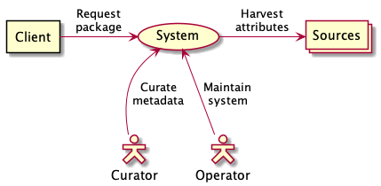
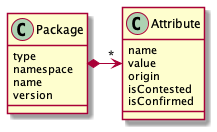

# BOM-base Service Architecture

## Introduction

### Purpose

This document provides a comprehensive architectural overview of the system,
using a number of different architectural views to depict different aspects of
the system. It is intended to convey the significant architectural decisions
which have been made on the system.

### Scope

BOM-base is an **experimental** caching repository for bill-of-materials
metadata.

### Definition, Acronyms and Abbreviations

Term | Description
-----|------------
PURL | Package URL, see the [Package URL specification](https://github.com/package-url/purl-spec).
SPDX | "The Software Package Data Exchange" - An open standard for communicating software bill of material information, including components, licenses, copyrights, and security references. SPDX reduces redundant work by providing a common format for companies and communities to share important data, thereby streamlining and improving compliance.

### References

- [SDPX License list](https://spdx.org/licenses/)
- [The Software Package Data Exchange (SPDX®) Specification Version 2.2](https://spdx.github.io/spdx-spec/)

## System context

A client application (e.g. a bill-of-materials tool) requests metadata for a
package from the system. The system harvests the attributes of this metadata
from external metadata sources (e.g. package management repositories and version
control systems). A curator manually resolves conflicting attribute values and
add values that could not be harvested automatically. An operator ensures the
system is properly installed and keeps running efficiently.

## Goals and constraints

Goals of the BOM-base service are:

1. Automatically collect metadata for relevant packages in a unified format.
2. Store metadata for non-public (inner source) packages.
3. Facilitate human curation of stored metadata.

The stakeholders of this application are:

- Metadata experts to maintain and curate metadata.
- Bill-of-materials tool developers.

The most significant requirements are:

- Package metadata shall be made available to clients in a single unified
  format.
- Licenses shall be stated as SPDX expressions.
- Package identification shall follow a public standard.
- Metadata shall be first harvested from local sources before external sources.
- Metadata shall be harvested from all popular package management repositories.
- Metadata shall be harvested from the ClearlyDefined repository.
- Package licenses shall be harvested from downloaded source code.
- Metadata shall be cross-checked between sources where possible.
- Human curators shall resolve conflicting and incomplete metadata.

Design constraints are:

- Maintainability: Code must be easy to maintain for average programmers. This
  is why the code tries to adhere to "Clean Code" guidelines, and a strict
  layering model is applied.

## Use-Case view

### Provide package metadata

1. A client (typically some Bill-of-Materials generator) encounters a package it
   needs more information about, and requests the service for the metadata
   related to the package.
2. The service looks up the available metadata for the indicated package and
   shares it with the client.

### Collect package metadata

1. A client encounters a package it needs more information about, and requests
   the service for the metadata related to the package.
2. The service did not know about the package before, and creates it in its data
   store.
3. The service notifies the client no information is available.
4. The service harvests package attributes from an external source (e.g. a
   package management repository), and stores it with the package.
5. The availability of a new attribute (e.g. the source code location) triggers
   the service to harvest more package attributes from another source (e.g. by
   scanning the package source code).
6. The service recursively harvests more attributes until there are no more
   sources to harvest from.

_Note that the harvesting attributes take time, and the client does not wait for
harvesting to complete. The resulting metadata is available the next time the
client requests the metadata for the same package._

### Correct failed harvesting

1. The service fails to harvest from a source due to wrong attribute values, or
   temporary unavailability of the source.
2. A curator requests an overview of failed harvests.
2. Service lists failed packages with a cause of the failure.
3. The curator manually corrects attribute values.
4. Service recursively harvests more attributes using the updated attribute(s).

### Curate metadata

1. Service detects conflicting attribute values by harvesting values from
   alternative sources, and marks one or more attributes as "contested".
2. A curator requests an overview of packages with contested attributes.
2. Service lists packages with contested attributes to the human curator.
3. Curator reviews the package attributes and marks, and (after appropriate
   research) manually overrides attributes.
4. Service stores the updated attributes and marks them as "confirmed".

_Attributes that have been confirmed by the curator can not longer be contested.
In such cases the client must assume the curated attributes are correct._

### Use-case realization

The figure below provides the domain model for the system:

Packages are uniquely identified by:

1. Type: References a type of package management repository.
2. Namespace: (Optional) grouping for related packages or packages from the same
   origin, as used by the package manager for the type.
3. Name: Identifier for the package.
4. Version: Revision name for the package, using the version numbering mechanism
   of the package manager for the type.

## Logical view

### Asynchronous harvesting of metadata

When a client application requests metadata for a package, the package is looked
up in the persistent metadata store. If the package is unknown, it is created.
This creation triggers the creation of one or more asynchronous tasks to
"harvest" metadata for the package from external sources. Because initially
nothing is known about the package, the synchronous response to the client is
empty.

After the asynchronous harvesting task is started, it queries metadata from an
external metadata source and stores the harvested attributes in the appropriate
fields of the package registration. Modification of an attribute (like the
source code location) can recursively initiate new harvesting tasks that
asynchronously harvest additional metadata from another source (like a source
code license scanner).

Upon the next request from a client for the same package, the meanwhile
collected metadata is returned synchronously to the client.

### Tracking metadata values

Packages are uniquely identified by
a [Package URL](https://github.com/package-url/purl-spec) that includes
information about its origin, name and version.

The metadata for a package is stored in attribute fields of predefined types.
Attribute values are updated with a specified confidence of the value being
correct. This confidence percentage overwrites a prior value only if the
confidence in the new value is higher than the existing value. This allows
updates by asynchronous harvesting tasks (and manual corrections) to stabilize
on the "best" available value for each attribute.

To identify occasions where human curation is required, the next highest
confidence value is also kept as indication of any disagreement between metadata
sources. A human curator can use this information as a reason to investigate and
manually provide corrections. The verdict of a human curator is stored with 100%
confidence, automatically overriding the prior value and clearing any contesting
value.

### Asynchronous harvesting

Each harvester registers a listener with the metadata store. When a new package
is created or any package attributes are updated, all listeners are polled for
new harvesting tasks. Based on the modified fields and current values of the
other attributes, each listener can submit a new harvesting task. These tasks
are queued for asynchronous execution.

Upon starting a harvesting task, it receives the latest package metadata which
it can use to collect new attribute values from its supported sources. After
harvesting attribute values, it updates the package metadata using confidence
scores based on the reliability of the source providing the metadata.

After completion of a harvesting task that modified a attribute, all listeners
are again polled for new harvesting tasks. This continues until no attributes
are updated, resulting in a cascade of asynchronous harvesting tasks that
collect all available attributes from the available sources.

As (some) sources could be updated after harvesting of metadata for a package,
it is important to periodically refresh the metadata from sources that are still
in use. Upon reading a package, new harvesting tasks are triggered based on the
completion timestamp of the most recent harvest task. (This mechanism has not
been implemented yet.)

## Process view

### Web server

The service runs as a (containerless) web server, allocating a thread per
received web request without tracking sessions. Database access is handled
synchronously by the same thread, and license scan requests are queued for
asynchronous scheduling.

### Asynchronous harvesting tasks

Harvesting tasks are queued for execution in a `ThreadPoolTaskExecutor`, and
receive their persistence context at the moment of execution. This implies that
each harvester runs in its own database transaction that lasts as long as the
execution of the harvester task.

## Deployment view

(TO DO)

## Implementation view

### Overview

The service is coded in Java using Spring Boot to reduce boilerplate code for
web endpoint handling (using Spring MVC) and persistence of data (using JPA on
Hibernate) to a database.

### Layers

(TO DO)

### ClearlyDefined harvester

This harvester collects package metadata from
the [ClearlyDefined](https://clearlydefined.io)
open source knowledge base. It submits a harvesting task upon the creation of a
new package, and updates the available attributes.

The confidence score is derived by using the scores provided in the
ClearlyDefined response as a fraction of the maximum score for this source.

(TO DO)

(End of document)
